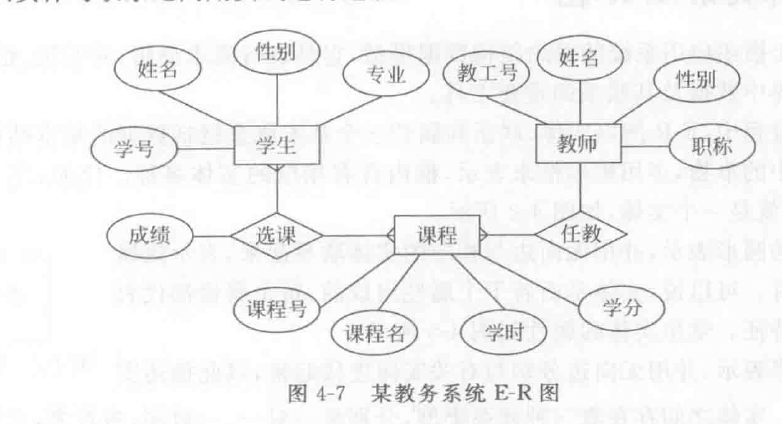
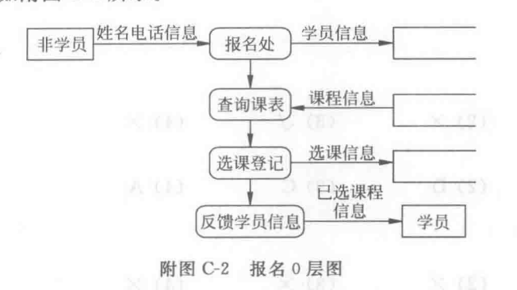
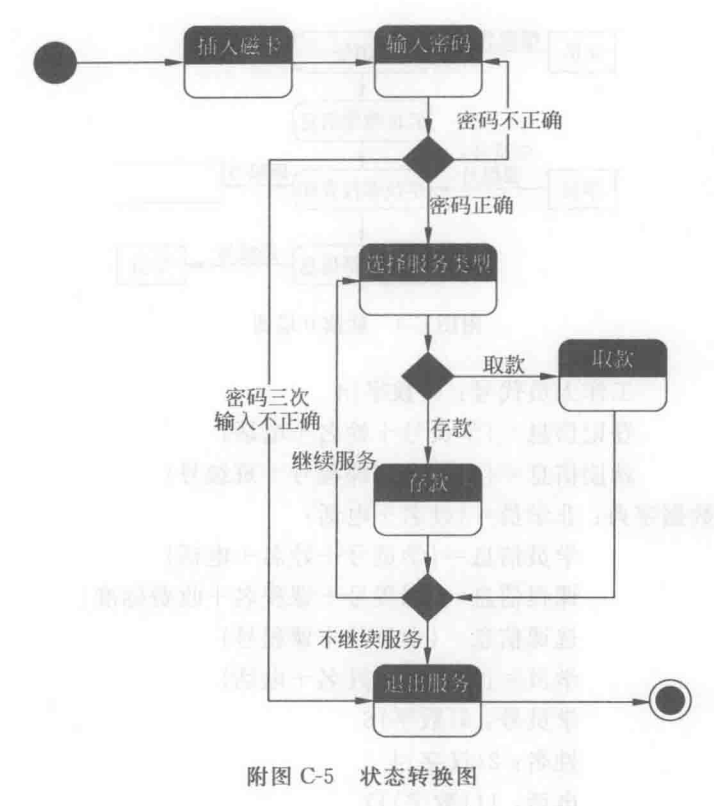
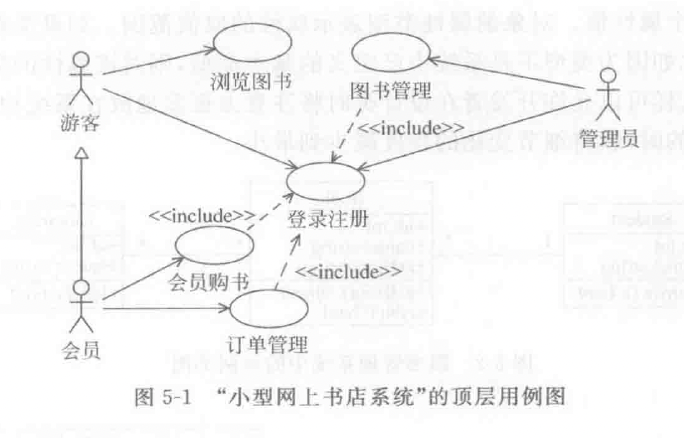

## 软件工程概述
**软件的特点**
1. 逻辑实体，无物理实体，具有抽象性。
2. 与硬件制造不同，在分析开发测试等各阶段渗透了大量脑力劳动。
3. 使用期间无磨损老化问题，但需要维护。
4. 软件的开发受计算机系统和硬件的制约。
5. 具有可复用性，一旦开发完成很容易大量复制。

**软件分类**
+ 系统软件/支撑软件/应用软件
+ 通用软件/定制软件
+ 小型/中型/大型软件
+ 实时/分时/交互式/批处理软件

**软件危机**
1. 软件产品不能满足用户要求
2. 软件开发成本较高，质量难以保证
3. 难以估计软件开发的成本和周期
4. 风险难以控制，市场变化快
5. 软件产品修改困难，集成遗留系统更难
6. 软件文档不完善

**软件工程**：为了经济可靠得获得能在实际机器上高效运行的软件而建立和使用的工程规则。

**软件生命周期**：可行性研究、需求分析、软件设计、编码、软件测试、软件维护。 
**软件工程三要素**：过程（生命周期内的一系列活动）、方法（面向过程/对象/数据，形式化）、工具（软件开发工具/环境）。 
**软件工程研究内容**： 目标、过程、原则。

**目标**:
1. 实现功能
2. 较好性能
3. 高质量
4. 较低开发成本
5. 较低维护费用
6. 按时交付

**原则**:
1. 用分阶段的生命周期计划严格管理
2. 坚持阶段评审
3. 实行严格的产品控制
4. 采用现代程序设计技术
5. 结果应能清楚地审查
6. 开发人员应少而精
7. 承认不断改进软件工程实践的必要性

## 软件过程
软件过程的软件生命周期阶段：
1. 可行性研究
2. 需求分析
3. 软件设计
4. 编码
5. 软件测试
6. 运行与维护

## 需求分析
**可行性研究与需求分析**： 
可行性研究确定做不做，需求分析回答做什么。前者包括技术可行性/经济可行性/社会可行性，后者有功能性需求和非功能性需求之分，前者产出可行性研究报告，后者产出软件需求规格说明书。

**需求分析步骤**：需求获取，分析建模，编写文档，需求验证。 

### 结构化需求分析
定义： 面向数据流，数据封闭原则的需求分析方法。

数据建模：实体关系图（E-R图） 
矩形实体，椭圆属性，菱形关系（1对1/1对多/多对多）

功能建模：数据流图（DFD） 
信息源，矩形，人或外部实体或其他系统
加工，圆角矩阵，表示处理系统
流向，箭头
数据存储，矩形缺右边。
一般分为顶层（1个加工）/中层/底层或0层（具体模块）数据流图。

行为建模：状态转换图（STD）
起点、重点（可没有）
圆角矩阵，上层标识事件名（中间层可有数据变量，下层有活动表），菱形框，条件转移状态，箭头表示触发事件。

数据字典：对数据流图中的图形元素做出具体的说明，包括数据流、数据存储、数据项、数据加工。

### 面向对象需求分析
对象的三种成分：标识/属性/方法 
面向对象的三大特性：封装/继承/多态 

UML：统一建模语言，用于软件的分析和设计，用于图形化展示软件系统。 
UML基本构造块：事物，关系，图。

#### 用例图
事物包括参与者和用例。
用例之前有包含，扩展，泛化的关系，参与者间有泛化的关系。

### 类图
类之间的关系：关联/依赖/泛化/实现，而关联有1对1，1对多，多对多，聚合和组合（实心）关系。类图包括：类名、属性、方法。

### 状态图
某个对象或类的行为建模，表示对象或类的状态转换关系。

### 时序图
使用时序图描述用例的事件流，标识用例的参与者，以服务的形式将用例的行为分配到对象上。

**面向对象分析方法：**
1. 获取需求
2. 建立用例模型
3. 识别分析类（实体/边界（用户界面，外部接口，数据存储）/控制类（封装用例的逻辑行为，一般一个用例对一个控制类。）
4. 定义类之间的关系
5. 定义交互行为
6. 建立分析模型

面向对象分析应得到的模型：
+ 对象模型，类图
+ 动态模型，顺序图/活动图/状态图
+ 功能模型，数据流图